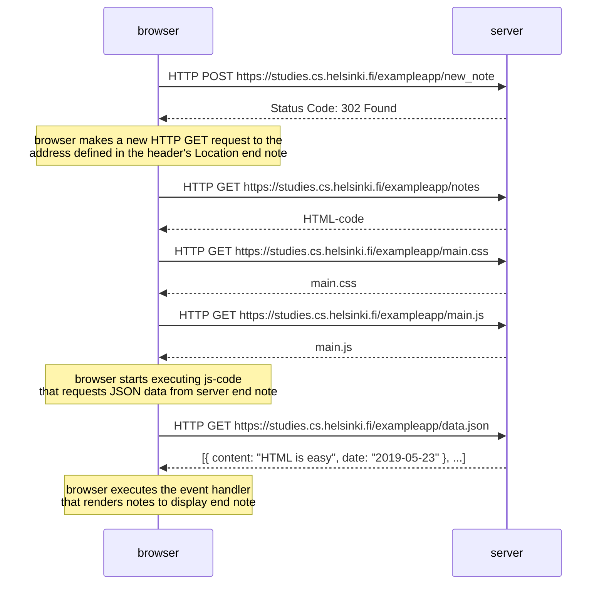
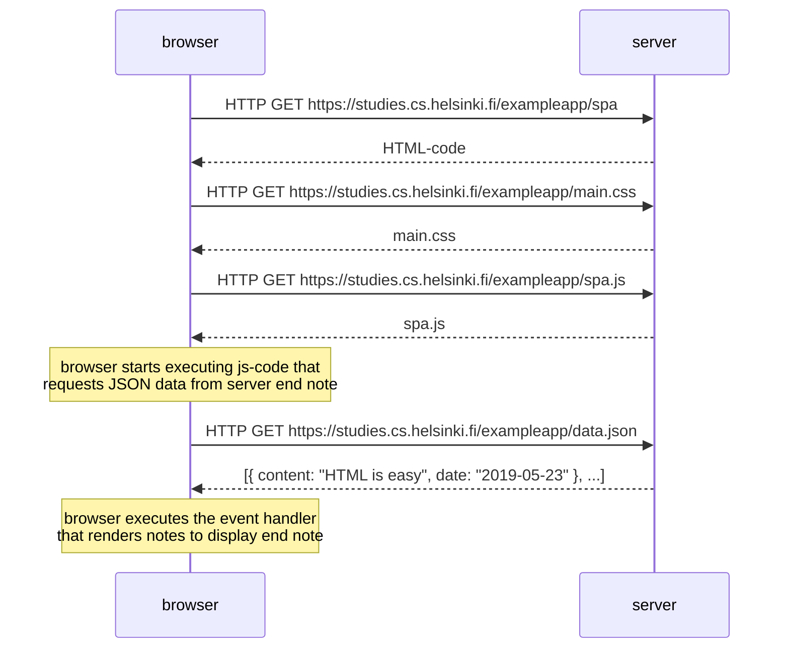
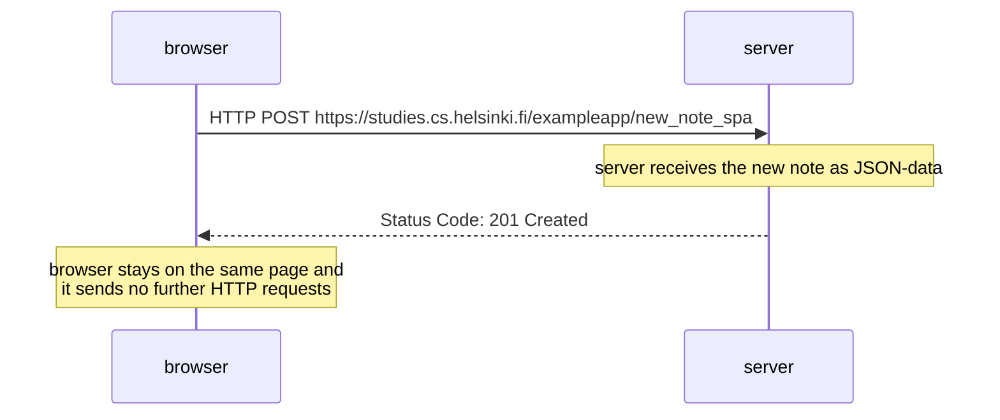

# Part 0 exercises

## Exercise 0.1, 0.2 and 0.3
* Reviewed the [basics of HTML](https://developer.mozilla.org/en-US/docs/Learn/Getting_started_with_the_web/HTML_basics) :white_check_mark:	
* Reviewed the [basics of CSS](https://developer.mozilla.org/en-US/docs/Learn/Getting_started_with_the_web/CSS_basics) :white_check_mark:	
* Reviewed the [basics of HTML forms](https://developer.mozilla.org/en-US/docs/Learn/HTML/Forms/Your_first_HTML_form) :white_check_mark:	

## Exercise 0.4: New note
A diagram depicting the situation where the user creates a new note on page https://studies.cs.helsinki.fi/exampleapp/notes when writing something into the text field and clicking the submit button.

## Exercise 0.5: Single page app

A diagram depicting the situation where the user goes to the single page app version of the notes app at https://studies.cs.helsinki.fi/exampleapp/spa.

## Exercise 0.6: New note
A diagram depicting the situation where the user creates a new note using the single page version of the app.

